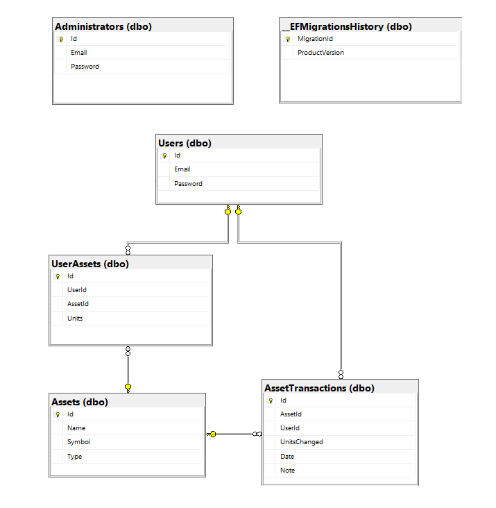
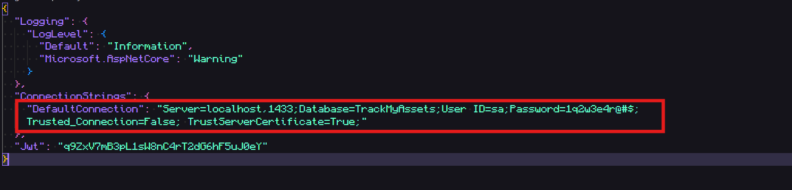
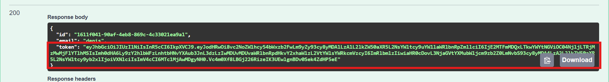
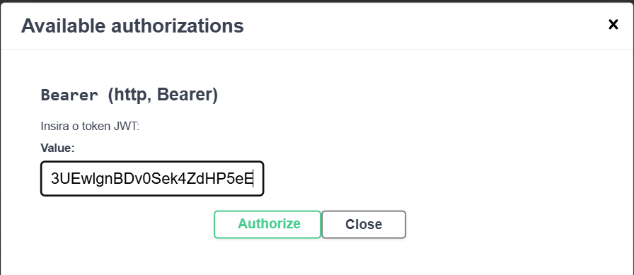
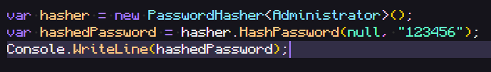
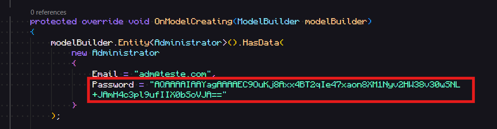

# TrackMyAssets_API

TrackMyAssets_API é uma API REST desenvolvida em C# com .NET 8, focada no registro e gerenciamento de movimentações de ativos financeiros.

O principal objetivo deste projeto é o aperfeiçoamento de habilidades no desenvolvimento de APIs REST, além de proporcionar maior familiaridade com conceitos do Entity Framework, autenticação com JWT e arquitetura em camadas com injeção de dependência.

Atualmente, a API suporta os seguintes tipos de ativos:

- Cryptocurrency (Criptomoeda)

- RealStateFund (Fundo Imobiliário)

- Stock (Ação)

## Tecnologias utilizadas


## Funcionalidades

- Gerenciamento de usuários

- Autenticação com JWT

- Gerenciamento de ativos

- Registro de movimentações dos ativos de usuários

- Documentação via Swagger

## Segurança

- As senhas dos usuários são armazenadas com hashing, garantindo que não fiquem salvas em texto puro no banco de dados.

- Autenticação e autorização são feitas via tokens JWT.

## Perfis de Acesso e suas funções

A aplicação possui dois perfis de acesso: Administradores e Usuários. Cada um possui permissões específicas que garantem segurança e organização nas operações realizadas.

### Administrador

#### O administrador tem acesso completo às operações administrativas e de controle dos usuários. As principais funcionalidades são:

- Login de administrador: POST /administrators/login

- Listar todos os usuários com paginação: GET /administrators/users

- Buscar usuário por Id: GET /administrators/users/{id}

- Deletar um usuário específico: DELETE /administrators/users/{id}

#### Gerenciar ativos disponíveis no sistema:

- Criar: POST /assets

- Atualizar: PUT /assets/{id}

- Deletar: DELETE /assets/{id}

- Listar e buscar: GET /assets, GET /assets/{id}

Administradores não possuem ativos próprios. Seu papel é exclusivamente gerencial, criando e mantendo os ativos disponíveis no sistema e supervisionando os usuários.


### Usuário

#### O usuário final é quem efetivamente registra e acompanha suas movimentações de ativos. Ele possui funcionalidades específicas para gerenciamento de sua conta e de seus ativos.

- Cadastro de usuário: POST /users

- Login de usuário: POST /users/login

- Atualizar dados de usuário (email/senha): PUT /users

- Deletar a própria conta: DELETE /users

#### Gerenciamento de ativos próprios:

- Adicionar unidades de um ativo: POST /users/assets

- Remover unidades: DELETE /users/assets

- Listar todos os ativos do usuário: GET /users/assets

- Obter detalhes de um ativo específico: GET /users/assets/{assetId}

## Banco de Dados

O banco de dados foi gerado por meio das *migrations* do **Entity Framework Core**, garantindo versionamento e evolução consistente do schema.

A aplicação utiliza o **SQL Server** como banco de dados principal, hospedado na **Azure**.

Durante o desenvolvimento, utilizei uma instância local do SQL Server via **Docker**, facilitando testes e integração sem depender da nuvem.

### Diagrama do Banco de Dados




### Ferramentas utilizadas

- **Entity Framework Core** – ORM para .NET
- **SQL Server** – Banco de dados relacional
- **Docker** – Ambiente local de desenvolvimento
- **Azure SQL** – Banco de dados em nuvem para produção


## Endpoints

Abaixo estão listadas as principais rotas da aplicação, agrupadas por função e com os respectivos níveis de permissão.

### Administradores (`/administrators`)

| Método | Rota                      | Descrição                                  | Autenticação |
|--------|---------------------------|--------------------------------------------|--------------|
| GET    | `/administrators/dashboard`   | Overview para administrador            | ✅ (Admin)    |
| GET    | `/administrators/users`   | Listagem paginada de usuários              | ✅ (Admin)    |
| GET    | `/administrators/users/{id}` | Detalhes de um usuário específico       | ✅ (Admin)    |
| POST   | `/administrators/login`   | Login do administrador                     | ❌             |
| PUT    | `/administrators/change-password` | Atualização da própria senha       | ✅ (Admin)    |
| DELETE | `/administrators/users/{id}` | Exclusão de usuário                     | ✅ (Admin)    |

### Usuários (`/users`)

| Método | Rota              | Descrição                               | Autenticação |
|--------|-------------------|-----------------------------------------|--------------|
| POST   | `/users/login`    | Login do usuário                        | ❌            |
| POST   | `/users`          | Criação de novo usuário                 | ❌            |
| PUT    | `/users`          | Atualização dos próprios dados          | ✅ (User)    |
| PUT    | `/users/change-password` | Atualização da própria senha     | ✅ (User)    |
| PUT    | `/users/change-email` | Atualização do própria email        | ✅ (User)    |
| DELETE | `/users`          | Exclusão da própria conta               | ✅ (User)    |

### Ativos (`/assets`)

| Método | Rota              | Descrição                               | Autenticação |
|--------|-------------------|-----------------------------------------|--------------|
| GET    | `/assets`         | Listagem de ativos                      | ✅ (User/Admin) |
| GET    | `/assets/{id}`    | Detalhes de ativo específico            | ✅ (User/Admin) |
| GET    | `/assets/{name}`    | Detalhes de ativo específico          | ✅ (User/Admin) |
| POST   | `/assets`         | Criação de novo ativo                   | ✅ (Admin)      |
| PUT    | `/assets/{id}`    | Atualização de ativo                    | ✅ (Admin)      |
| DELETE | `/assets/{id}`    | Exclusão de ativo                       | ✅ (Admin)      |

### Movimentações de Ativos (`/users/assets`)

| Método | Rota                   | Descrição                           | Autenticação |
|--------|------------------------|-------------------------------------|--------------|
| GET    | `/users/assets`        | Listar todos os ativos do usuário                | ✅ (User)     |
| GET    | `/users/assets/{id}`   | Detalhes de um ativo do usuário                  | ✅ (User)     |
| POST   | `/users/assets`        | Adicionar as primeiras unidades de um ativo      | ✅ (User)     |
| PUT    | `/users/assets`        | Atualizar unidades de um ativo                   | ✅ (User)     |

### Health (`/users/assets`)

| Método | Rota                   | Descrição                           | Autenticação |
|--------|------------------------|-------------------------------------|--------------|
| GET    | `/`   | Verifica a disponibilidade da API     | ❌           |


## Para executar localmente

### Pré requisitos

- Ter o <a href="https://dotnet.microsoft.com/pt-br/download/dotnet/8.0">.NET 8.0</a> instalado na máquina.

- Um banco de dados SQL Server local ou hospedado (ex: via Docker ou Azure).

- Opcionalmente: Docker instalado, caso queira usar SQL Server via container. 


### Clone o repositório

```bash
git clone git@github.com:CostaDenis/TrackMyAssets_API.git
```

### Configurando o ambiente

No arquivo appsettings.Development.json (localizado na raiz do projeto), atualize a Connection String com as informações do seu banco de dados SQL Server.


### Rodando a aplicação

Execute o seguinte comando dentro da pasta do projeto para iniciar a API com hot reload:

```bash
dotnet watch run
```

## Observações para desenvolvimento

### Caso altere alguma entidade do projeto e precise atualizar o banco de dados:

1. Limpe o projeto:
```bash
dotnet clean
```

2. Compile o projeto:
```bash
dotnet build
```

3. Gere uma nova migration:
```bash
dotnet ef migrations add {Migration_Name}
```

4. Atualize o banco de dados:
```bash
dotnet ef database update
```

### Token JWT

Ao realizar o login, seja como usuário ou administrador, a aplicação retorna um token JWT:


Para usar este token, vá até o início da documentação no Swagger, clique no botão Authorize e cole o valor do token no campo exibido:


Esse token será utilizado para autenticar suas requisições protegidas pela API.

### Testando como Administrador
Para testar as funcionalidades do perfil de Administrador, siga os passos abaixo:

1. Escolha uma senha de sua preferência.

2. Gere o hash dessa senha em um projeto separado. Exemplo:


3. Copie o valor gerado e cole no arquivo ./Infrastructure/Data/AppDbContext.cs, no campo Password da criação do administrador:


Agora você já pode fazer login como Administrador utilizando o e-mail adm@teste.com e a senha correspondente ao hash que você definiu.


